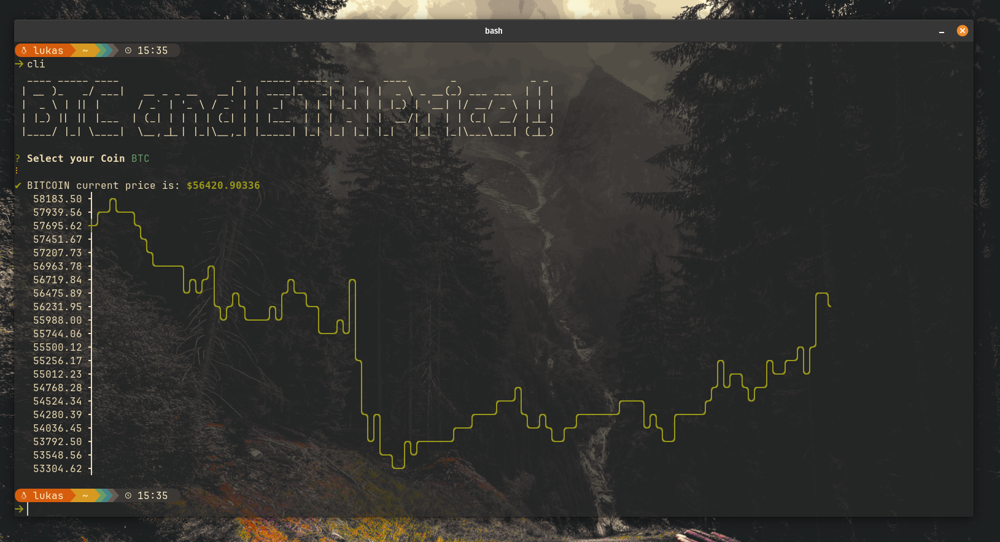

## Cli With NodeJs 



Command line tool to view Btc and Eth price simply and quickly, This application uses the coingecko API .

### Requirements

- Node js 
- npm or other package manager 

## Alias 

You can create an alias to call this cli 

- Create a shell script file like runCli.sh 

```shell

node /path/to/your/script/main.js 

 ```

### Save the file and give execute permission

 ```shell 
 
chmod +x /path/to/your/script/run-myscript.sh

 ```

 ### Create an alias 

Open your shell's configuration file:

- For bash, edite ~/.bashrc.
- For zsh, edite ~/.zshrc.

### Add the alias at the end of your file 

```shell
alias runmycmd='/path/to/your/script/run-myscript.sh'
```
### Refresh the shell to apply the changes: 

```shell 

source ~/.bashrc


```


```shell 

source ~/.zshrc


```

### Execute the command 

```shell 

runmycmd

```
by: Ianmello10

### Contribution 

Contributions are welcome ! 